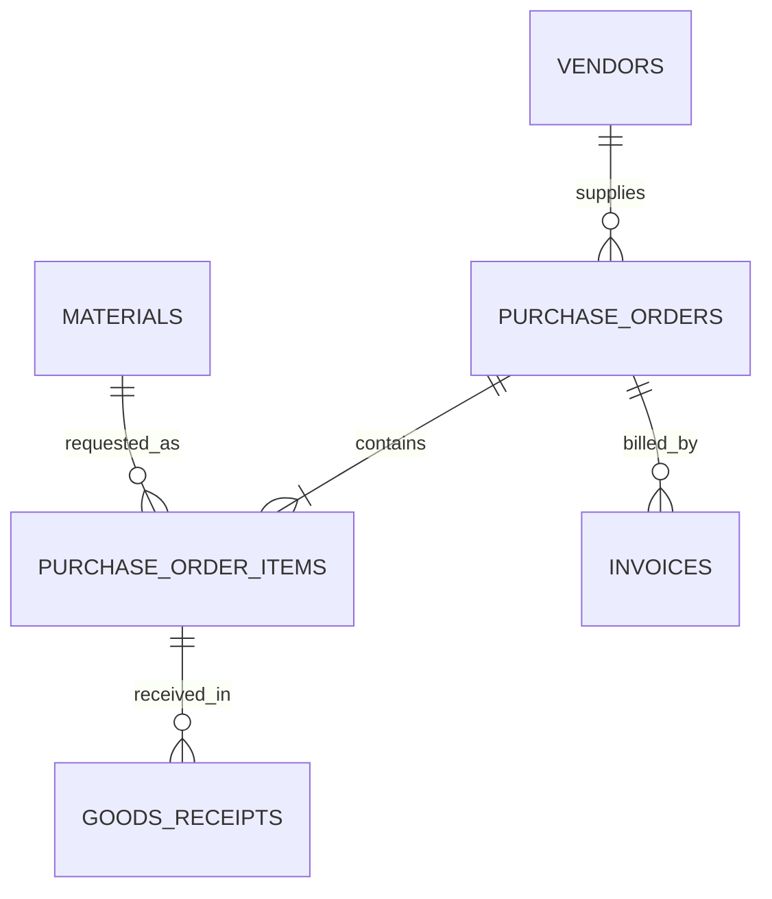

# SAP MM Procurement Analytics

An original SQL portfolio project that simulates a procure-to-pay workflow inspired by SAP Materials Management (MM).

> This is an independent learning project built with fictional data. It does not use or claim access to a real SAP system.

## Business scenario

A manufacturing company needs a transparent view of purchasing activity. The purchasing team wants to know:

- how much is ordered from each supplier;
- which order items are still open;
- which deliveries arrived late;
- whether invoiced values agree with received goods;
- which suppliers require operational attention.

The project models purchase orders, items, materials, suppliers, goods receipts and invoices. It then turns those transactions into useful procurement controls.

## Skills demonstrated

- Relational data modelling and composite keys
- SQL joins, aggregations and conditional logic
- Common table expressions (CTEs)
- Order-to-receipt reconciliation
- Three-way-match-style invoice controls
- Supplier performance indicators
- SAP-oriented naming and ABAP CDS view examples

## Data model



## Project structure

```text
sql/
  01_schema.sql             Database structure
  02_sample_data.sql        Fictional procurement transactions
  03_business_queries.sql   Procurement KPIs and exception reports
  04_data_quality.sql       Reconciliation and quality controls
  05_abap_cds_examples.txt  SAP-oriented CDS view examples
docs/
  business_findings.md      Interpretation of the generated results
reports/                    CSV reports created by the runner
run_project.py              Creates and analyses the SQLite database
```

## Run locally

Requirements: Python 3.10 or newer. No external packages are needed.

```bash
python run_project.py
```

The command recreates `procurement.db`, executes validated SQL reports and exports the results to `reports/` as CSV files.

## Portfolio highlights

The fictional dataset intentionally contains complete, partial, open and late procurement cases. Every query answers a concrete business question.

See [business findings](docs/business_findings.md) for the conclusions obtained from the sample run.

## SAP relevance

The relational design mirrors common procurement concepts such as purchasing document header/item separation and goods receipt tracking. The CDS examples show how the analytical logic could be expressed in an ABAP environment. Exact SAP tables and production rules vary by system and are deliberately not reproduced here.

## Author note

Created as a hands-on portfolio project for developing SQL, data analysis and SAP-oriented technical skills.

